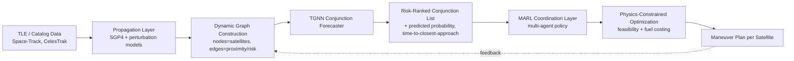
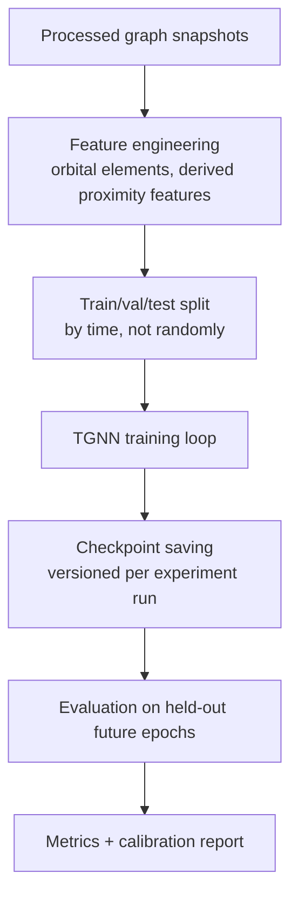

# ConstellAI
### Physics-Informed Autonomous Orbital Intelligence for Satellite Constellation Coordination

> **Project handbook** — this document is the single source of truth for anyone joining, reviewing, or evaluating this project: teammates, the industry mentor, faculty advisors, or external reviewers. Read this before touching any code.

**Status:** Pre-implementation / architecture phase
**Team:** 4 final-year B.Tech students (CS – AI & Data Science) + 1 Industry Mentor
**Duration:** 8–10 months
**Target venues:** AIAA SciTech, IEEE Aerospace Conference, ICRA, NeurIPS/ICLR workshops

> **Note on assumptions.** Several implementation details (exact library versions, cloud provider, CI runner, dataset mirror) are not yet fixed by the team. Wherever this document makes a concrete choice that hasn't been formally agreed on, it is marked **[ASSUMPTION]**. Wherever a task now carries an explicit **Goal / Definition of Done**, that goal is a proposed bar, not a guarantee — revise it if reality (Phase 0 findings especially) demands it, and log the revision as an ADR (Section 16) rather than silently editing it away.

---

## Table of Contents

1. [Project Overview](#1-project-overview)
2. [Project Goals](#2-project-goals)
3. [System Overview](#3-system-overview)
4. [Repository Structure](#4-repository-structure)
5. [Technology Stack](#5-technology-stack)
6. [Development Roadmap](#6-development-roadmap)
7. [Detailed Implementation Guide](#7-detailed-implementation-guide)
8. [Team Responsibilities](#8-team-responsibilities)
9. [Git Workflow](#9-git-workflow)
10. [Development Standards](#10-development-standards)
11. [Installation Guide](#11-installation-guide)
12. [Dataset Guide](#12-dataset-guide)
13. [Model Training Pipeline](#13-model-training-pipeline)
14. [Testing Strategy](#14-testing-strategy)
15. [Experiment Tracking](#15-experiment-tracking)
16. [Documentation Strategy](#16-documentation-strategy)
17. [Weekly Development Plan](#17-weekly-development-plan)
18. [Monthly Deliverables](#18-monthly-deliverables)
19. [Future Scope](#19-future-scope)
20. [References](#20-references)
21. [Contributor Guide](#21-contributor-guide)
22. [Troubleshooting](#22-troubleshooting)
23. [FAQ](#23-faq)
24. [Appendix](#24-appendix)
25. [Closing Recommendations](#25-closing-recommendations-from-the-mentor-role)

---

## 1. Project Overview

### 1.1 Vision

A world in which every satellite operator — from a national space agency to a two-person cubesat startup — can query a shared, continuously-updated picture of collision risk in Earth orbit, and receive coordinated, fuel-efficient avoidance recommendations, rather than each operator solving collision avoidance in isolation.

### 1.2 Mission

Build a research prototype, **ConstellAI**, that models the orbital environment as an evolving graph, uses a Temporal Graph Neural Network (TGNN) to forecast conjunctions (close approaches) several days ahead, and uses Multi-Agent Reinforcement Learning (MARL) to coordinate avoidance maneuvers across a constellation, subject to physical constraints (fuel budget, mission objectives, maneuver feasibility).

### 1.3 Problem Statement

Low Earth Orbit (LEO) is increasingly congested. Conjunction assessment today is largely:

- **Pairwise and reactive** — most operational systems (e.g., the U.S. Space Surveillance Network pipeline, ESA's Space Debris Office tools) screen object pairs against a catalog and flag close approaches individually, rather than reasoning about the constellation as a coupled system.
- **Single-timestep** — risk is usually assessed at a fixed future epoch rather than as an evolving trajectory of risk over multiple days.
- **Centralized and manual for avoidance decisions** — once a conjunction is flagged, deciding *who* maneuvers, *when*, and *how much* delta-v to spend is still largely a human, operator-by-operator process, which does not scale as constellations grow into the thousands (e.g., Starlink, OneWeb, Kuiper).

### 1.4 Existing Industry Challenges

| Challenge | Description |
|---|---|
| Catalog scale | Public catalogs (Space-Track) already track ~30,000+ trackable objects; mega-constellations push the *actively maneuverable* population into the thousands. |
| Uncertainty | State vectors derived from TLEs carry significant, non-Gaussian, growing uncertainty between epochs. |
| Coordination gap | No public, open system coordinates *multi-operator, multi-satellite* avoidance jointly — each operator optimizes for itself. |
| Fuel is finite | Every avoidance maneuver spends delta-v that shortens mission life; unnecessary maneuvers are a real cost, not just a formality. |
| Latency vs. accuracy | High-fidelity numerical propagation (special perturbations) is accurate but too slow to run continuously across a full mega-constellation graph; SGP4 is fast but approximate. |

### 1.5 Research Motivation

The intersection of **temporal graph learning** and **safe multi-agent RL**, applied to a **physically constrained, safety-critical, real-world dynamical system**, is an active and publishable research area. Most existing academic work addresses either (a) conjunction *prediction* as a supervised learning problem in isolation, or (b) collision avoidance as a single-satellite control problem. Treating the constellation as a dynamic graph and learning *both* forecasting and coordinated control jointly, under explicit physical constraints, is the project's core research angle. This must be validated against current literature before final scoping (see [6.1](#61-phase-0--literature--novelty-audit-weeks-13)) — the mentor's role includes actively looking for prior art that undercuts this framing, not just supporting it.

### 1.6 Why This Project Matters

- **Practical relevance**: collision avoidance coordination is an acknowledged, unsolved operational problem, not a synthetic academic exercise.
- **Feasibility with public data**: TLE/catalog data is freely available (Space-Track, CelesTrak), meaning the project does not depend on proprietary operator data to produce meaningful results.
- **Technical breadth**: touches orbital mechanics, graph representation learning, multi-agent RL, and safety-constrained optimization — a genuine systems-integration challenge, not a single-model exercise.

### 1.7 Expected Impact

A working prototype that:
- Demonstrably outperforms a pairwise-baseline conjunction screening approach on forecasting horizon and/or precision-recall, on public TLE data.
- Demonstrates *coordinated* (not independent) maneuver planning across a small simulated constellation, with measurable fuel savings versus independent per-satellite avoidance.
- Produces a reproducible codebase and a workshop/conference-ready paper.

---

## 2. Project Goals

Each goal below now carries an explicit **completion signal** — the observable fact that tells the team the goal is actually met, not just "worked on."

### Short-term goals (Months 1–3)
| Goal | Complete when |
|---|---|
| Finalize literature review and novelty framing | Mentor has signed off, in writing, on a one-paragraph novelty statement |
| Stand up data ingestion pipeline | A scripted run produces a versioned, schema-validated dataset snapshot with zero manual steps |
| Working non-learned conjunction-detection baseline | Baseline precision/recall numbers exist on a held-out time window and are logged in `experiments/results/` |

### Long-term goals (Months 4–8)
| Goal | Complete when |
|---|---|
| Trained TGNN conjunction-forecaster | Beats the Phase 1 baseline on held-out future epochs, with the comparison logged, not eyeballed |
| Trained MARL coordination policy | Outperforms an independent-agent baseline on fuel cost at matched safety level, in simulation |
| Physics-constrained optimization layer | Every maneuver the system outputs passes an automated feasibility check (fuel, delta-v, timing) with zero manual correction |

### Research goals
| Goal | Complete when |
|---|---|
| Literature-grounded novel contribution | Statement exists, cites specific prior work it differs from, and has survived mentor cross-examination |
| Ablations isolating *why* the approach works | At minimum: graph-structure ablation, temporal-component ablation, coordination-vs-independent ablation, all logged |

### Engineering goals
| Goal | Complete when |
|---|---|
| Reproducible, tested codebase | Any team member can clone, install, and reproduce any logged experiment's headline number from the config alone |
| Clean module separation | Each module in Section 3 is independently unit-testable without the others running |

### Publication goals
| Goal | Complete when |
|---|---|
| Workshop/conference submission | Paper submitted to a target venue (Section 20) with figures generated directly from `experiments/results/` |

---

## 3. System Overview



**Module responsibilities and their own "done" signal:**

| Module | Input | Output | Owns | Module is "working" when |
|---|---|---|---|---|
| Data Ingestion | Raw TLE feeds | Cleaned, versioned orbital element sets | Propagation correctness, data freshness | A scheduled/scripted run reproduces an identical dataset snapshot from the same source date |
| Propagation Layer | Orbital elements | State vectors (position/velocity) over time | SGP4 correctness, perturbation modeling | Output matches a published reference ephemeris within a stated, quantified tolerance |
| Graph Constructor | State vectors | Time-indexed graph snapshots | Node/edge feature design, thresholds | A synthetic 3-satellite case produces the exact hand-computed expected graph |
| TGNN Forecaster | Graph sequence | Conjunction probability + time-to-approach per pair | Model architecture, training, calibration | Beats the non-learned baseline on a held-out future time window, with a calibration curve logged |
| MARL Coordinator | Forecasted risk graph | Per-satellite action recommendations | Reward design, policy training, safety constraints | Trained policy avoids conjunctions at a target safety rate while using less aggregate fuel than independent agents |
| Optimization Layer | Raw policy actions | Feasible, fuel-costed maneuver plans | Constraint satisfaction, delta-v budgeting | 100% of output maneuvers pass automated feasibility checks with no manual patching |
| Simulation & Evaluation | All of the above | Metrics, ablations, figures | Reproducibility, experiment tracking | Any teammate can regenerate any paper figure from its logged config alone |

Every module must be independently testable — the TGNN must be evaluable without the RL layer running, and the RL layer must be trainable against a frozen or mocked forecaster before end-to-end integration. This is deliberate: end-to-end-only systems are extremely hard to debug and even harder to defend to a reviewer asking "what does each component contribute?"

---

## 4. Repository Structure

```
constellai/
├── backend/
│   ├── propagation/          # SGP4 wrappers, perturbation models, coordinate transforms
│   ├── graph/                 # Dynamic graph construction, feature engineering
│   ├── models/
│   │   ├── tgnn/               # Temporal GNN architecture, training loop, inference
│   │   └── marl/                # Agent policies, environment, training loop
│   ├── optimization/          # Physics-constrained maneuver feasibility + delta-v costing
│   ├── simulation/            # End-to-end simulated constellation environment
│   └── api/                    # Serving layer (if/when a demo API is built)
├── frontend/                  # Visualization dashboard (constellation state, risk, maneuvers)
├── datasets/
│   ├── raw/                    # Unmodified downloaded TLE/catalog snapshots (gitignored)
│   ├── processed/              # Cleaned, versioned datasets actually used for training
│   └── scripts/                # Download + preprocessing scripts (checked in)
├── experiments/
│   ├── configs/                 # One config file per experiment run
│   ├── logs/                    # Experiment tracker output (gitignored, or DVC/W&B pointers)
│   └── results/                 # Aggregated results tables/figures used in the paper
├── notebooks/                  # Exploration only — nothing here is a dependency of backend/
├── docs/
│   ├── architecture/            # ADRs, diagrams, design docs
│   ├── research-notes/          # Weekly research notes, literature summaries
│   └── meeting-notes/           # Dated meeting logs
├── papers/                     # LaTeX source for the eventual paper submission
├── tests/
│   ├── unit/
│   ├── integration/
│   └── e2e/
├── scripts/                    # One-off utility / dev scripts
├── .github/workflows/          # CI/CD definitions
├── pyproject.toml / requirements.txt
└── README.md                   # this file
```

**Why this structure:**
- `backend/models/tgnn` and `backend/models/marl` are siblings, not nested — they must be trainable and testable independently (see Section 3).
- `datasets/raw` vs `datasets/processed` separation exists so preprocessing is always reproducible from raw data, and raw data is never mutated in place.
- `notebooks/` is explicitly quarantined from `backend/` — nothing in production code should import from a notebook; the reverse (notebooks importing backend modules) is fine and encouraged.
- `papers/` lives in the same repo (not a separate one) so figures generated in `experiments/results/` can be referenced directly without cross-repo sync pain — **[ASSUMPTION]**: revisit if the team prefers Overleaf.

**Goal for this section:** repo skeleton exists, matches this structure exactly, and a trivial commit passes CI — see Section 6.2 / Week 4.

---

## 5. Technology Stack

> **[ASSUMPTION]** — the following stack is a recommended starting point based on your stated PyTorch/HuggingFace background and the project's requirements. It has not been formally ratified by the full team and should be treated as a proposal for Week 1 discussion, not a locked decision. **Goal: stack ratified (or explicitly revised) by end of Week 1, recorded as an ADR.**

| Layer | Choice | Why chosen | Alternatives considered | Trade-off |
|---|---|---|---|---|
| Orbital propagation | `sgp4` (Python), `poliastro` / `skyfield` for higher-fidelity checks | Industry-standard TLE propagator; free, well-tested | Writing SGP4 from scratch (rejected: reinventing a validated, subtle algorithm is a research-time sink with no novelty payoff) | SGP4 itself has known accuracy limits vs. special perturbation methods — must be stated explicitly in the paper as a modeling assumption |
| Graph deep learning | PyTorch Geometric (PyG) or DGL, specifically evaluate `PyTorch Geometric Temporal` | Mature temporal-GNN support, active community, matches existing PyTorch background | Building custom message-passing in raw PyTorch (rejected for time cost); JAX/Jraph (rejected: smaller community, steeper ramp for a 4-person undergrad team) | PyG has less mature temporal-graph tooling than static-graph tooling |
| RL framework | RLlib or a lightweight custom MARL loop (PettingZoo + custom PPO) | RLlib has production-grade MAPPO/QMIX implementations; PettingZoo is the standard multi-agent env API | Writing MARL from scratch (rejected: correctness bugs in RL are notoriously hard to detect; use validated implementations first) | RLlib has a real learning curve and can feel like a black box — team must still understand the underlying algorithm |
| Simulation environment | Custom, built on `sgp4`/`poliastro` propagation, wrapped as PettingZoo/Gym-style env; evaluate Basilisk (AVS Lab) first | No existing open-source multi-satellite MARL environment fits this exact problem | Basilisk — a real, high-fidelity astrodynamics simulator worth evaluating before committing to a custom build | Basilisk has a steep setup curve; custom sim is faster to start but risks accuracy gaps a reviewer will probe |
| Experiment tracking | Weights & Biases (or MLflow if data-residency is a concern) | Minimal setup, good default dashboards, easy ablation comparison | Plain CSV logging (rejected: does not scale past week 2 with 4 people running parallel experiments) | W&B free tier has usage limits — check before committing |
| Backend/API (if built) | FastAPI | Async support, automatic OpenAPI docs, matches Python-first stack | Flask/Django (rejected: heavier than needed for a research demo API) | Only needed if a live demo is required |
| Frontend (if built) | React + Cesium.js/deck.gl for 3D orbit rendering | Standard for interactive dashboards, visually compelling | Plotly Dash (simpler, less "wow factor") | 3D orbit visualization is a real engineering side-quest — scope as nice-to-have |
| CI/CD | GitHub Actions | Free for public/student repos, integrated with GitHub workflow | GitLab CI, Jenkins (unnecessary infra overhead for 4 people) | — |
| Data/model versioning | DVC | Git-friendly versioning for large datasets/checkpoints | Git LFS (viable, less ML-specific) | Adds a tool to learn — introduce in Phase 1, not day 1 |

---

## 6. Development Roadmap

Every phase below now states an explicit **Goal (Definition of Done)** in addition to objectives/deliverables — the single sentence that settles "are we actually finished with this phase" without debate.

### 6.1 Phase 0 — Literature & Novelty Audit (Weeks 1–3)

- **Goal / Definition of Done:** A novelty statement exists, is signed off by the mentor in writing, and an explicit scope-reduction document exists stating what the team will *not* attempt at prototype scale.
- **Objectives**: Establish exactly what has and hasn't been done in TGNN-based conjunction prediction and MARL-based satellite coordination.
- **Deliverables**: Literature review (`docs/research-notes/`) with a comparison table of 10–15+ papers; one-paragraph novelty statement.
- **Dependencies**: None — true starting point, before any code.
- **Expected output**: Go/no-go decision on the core research framing.
- **Possible challenges**: Finding a very similar existing system — if so, the differentiator must be found immediately, not after months of engineering.

### 6.2 Phase 1 — Data & Simulation Foundation (Weeks 4–9)

- **Goal / Definition of Done:** A single scripted command produces a validated, versioned dataset snapshot and outputs a baseline conjunction-detection precision/recall number on held-out data — with no manual steps anywhere in that chain.
- Data ingestion pipeline; propagation correctness validated against known reference orbits.
- Dynamic graph construction with a first pass at node/edge features.
- Non-learned baseline conjunction screener — the number every learned model must beat.

### 6.3 Phase 2 — TGNN Forecaster (Weeks 10–18)

- **Goal / Definition of Done:** A trained temporal model beats the Phase 1 baseline on a time-based held-out split, with a calibration report and a static-GNN ablation both logged in `experiments/results/`.
- Baseline static-GNN conjunction classifier first (establishes the graph-learning pipeline works at all).
- Extend to temporal architecture (TGN, EvolveGCN, or a custom temporal-attention layer — **[ASSUMPTION]**: exact choice deferred to Phase 0/1 findings).
- Calibration and evaluation against the Phase 1 baseline.

### 6.4 Phase 3 — MARL Coordination (Weeks 19–28)

- **Goal / Definition of Done:** A trained multi-agent policy achieves a defined target safety rate (e.g., X% of injected conjunctions avoided) at strictly lower aggregate fuel cost than an independent-agent baseline, in simulation.
- Single-agent RL sanity check first (one satellite, avoid one conjunction) before multi-agent.
- Multi-agent training (MAPPO as the default starting algorithm).
- Reward shaping iteration — budget real time for this explicitly; it will take longer than planned.

### 6.5 Phase 4 — Integration & Physics-Constrained Optimization (Weeks 29–33)

- **Goal / Definition of Done:** The full pipeline (TGNN → MARL → optimization layer) runs end-to-end on a fixed test scenario, and every output maneuver passes automated feasibility checks with zero manual correction.
- Connect TGNN output → MARL input.
- Add hard feasibility constraints (fuel budget, maneuver limits) as a constrained-optimization or action-masking layer.

### 6.6 Phase 5 — Evaluation, Ablation, and Paper Writing (Weeks 34–40)

- **Goal / Definition of Done:** All planned ablations (Section 14) are logged, every figure in the paper draft is regenerable from a logged experiment config, and a complete paper draft exists ahead of the submission deadline (not the night before).
- Full ablation suite.
- Draft paper in parallel with final experiments, not after.

---

## 7. Detailed Implementation Guide

> This section is intentionally left as a **living document skeleton** rather than fully populated code-by-code instructions: writing exhaustive implementation steps for an architecture that hasn't cleared Phase 0 would mean inventing decisions the team hasn't made yet. What follows is the structure — including an explicit goal field — to fill in as each phase is actually implemented.

### Step template (repeat for every implementation step from Phase 1 onward)

```
### Step N: <name>
**Goal (Definition of Done):** <the one observable fact that proves this step is finished>
**What to do:**
**Why:**
**Expected output:**
**Commands:**
**Files created/modified:**
**Common mistakes:**
**Validation:** (how do we know this step succeeded, concretely — a test, a number, a diff?)
```

**First concrete steps to populate once Phase 0 is signed off** (recommended order, each with its goal already defined):

1. **Step 1 — Repo + CI skeleton.**
   **Goal:** A trivial commit to `main` triggers CI and passes, on a repo matching the Section 4 structure exactly.
2. **Step 2 — TLE ingestion script.**
   **Goal:** Running the script twice on the same date produces byte-identical output, and a test asserts the expected record count/schema.
3. **Step 3 — SGP4 propagation wrapper.**
   **Goal:** Propagated output for a known reference TLE matches a published reference ephemeris within a stated, quantified tolerance (not "looks about right").
4. **Step 4 — Dynamic graph constructor.**
   **Goal:** A synthetic 3-satellite case with a hand-computed expected graph passes as a unit test, exactly.

Each subsequent step should be added **as it is actually implemented**, by whichever team member owns that module, with its goal defined *before* work starts on it — not retrofitted afterward to match whatever got built.

---

## 8. Team Responsibilities

> **[ASSUMPTION]** — roles below are structured around the *module boundaries* in Section 3, not specific people, since names/skills of the other three members haven't been specified. Substitute actual names once assigned. **Goal for this section: roles assigned to real names by end of Week 1.**

| Role | Primary modules | Deliverables | Core skills needed |
|---|---|---|---|
| **Member 1 — Orbital Mechanics & Data Lead** | Propagation, Data Ingestion | Validated propagation layer, versioned datasets | Orbital mechanics, SGP4, data engineering |
| **Member 2 — Graph Learning Lead** | Graph Constructor, TGNN Forecaster | Trained/evaluated TGNN model, calibration report | GNNs, PyTorch, temporal modeling |
| **Member 3 — RL Lead** | MARL Coordinator, Simulation environment | Trained MARL policy, environment code | RL theory, MAPPO/QMIX, environment design |
| **Member 4 — Systems & Optimization Lead** | Optimization layer, API/Frontend, CI/CD | Feasibility layer, demo interface, working CI pipeline | Software architecture, optimization, DevOps |
| **Industry Mentor** | Cross-cutting review | Weekly checkpoint reviews, go/no-go decisions at phase boundaries, literature/novelty gatekeeping, paper-quality review | Domain + research rigor across all of the above |

**Review checkpoints (mentor):** end of each phase in Section 6, plus any point a team member requests unblock on a design decision — each checkpoint is scored against that phase's stated Goal/Definition of Done, not general impressions.

---

## 9. Git Workflow

- **Branch strategy**: `main` (always deployable/reproducible) ← `develop` (integration) ← feature branches.
- **Naming convention**: `feature/<module>-<short-desc>`, `fix/<module>-<short-desc>`, `experiment/<name>`.
- **Commits**: Conventional Commits — `feat(tgnn): add temporal attention layer`, `fix(propagation): correct J2 sign error`.
- **Pull requests**: every PR into `develop` requires at least one reviewer from a *different* module than the author; PRs into `main` require mentor sign-off at phase boundaries.
- **Code review**: correctness of physics/math first, style second.
- **Merge strategy**: squash-merge feature branches into `develop`; merge-commit `develop` into `main` at phase boundaries.
- **Release strategy**: tag a release at each phase completion (`v0.1-phase1`, etc.) so results always trace to an exact commit.
- **Conflict resolution**: PR author resolves conflicts against `develop` before requesting re-review.

---

## 10. Development Standards

- **Coding standards**: `black` + `ruff`/`flake8` via pre-commit; type hints required on public functions.
- **Folder conventions**: as in Section 4 — no code outside its module folder without a documented reason in the PR.
- **Documentation standards**: every module has a `README.md`; every non-trivial function documents units explicitly (degrees vs. radians, seconds vs. days — this matters enormously in orbital mechanics).
- **Logging standards**: Python `logging`, not `print`; structured logs for experiment runs.
- **Error handling**: propagation/physics code fails loudly on invalid input rather than silently returning a plausible-looking wrong answer.
- **Configuration management**: all experiment configs versioned under `experiments/configs/`, never hardcoded hyperparameters.
- **Environment variables**: `.env.example` checked in; real `.env` gitignored.
- **Secrets management**: no credentials (e.g., Space-Track login) committed; environment variables or a secrets manager only.

---

## 11. Installation Guide

> **[ASSUMPTION]** — exact OS/Python version pinned as a starting recommendation; confirm as a team. **Goal: this exact sequence works on a clean machine for every team member by end of Week 4.**

```bash
# 1. Install Python 3.11+ (recommended)
python3 --version

# 2. Install Git
git --version

# 3. Clone the repository
git clone https://github.com/<org>/constellai.git
cd constellai

# 4. Create a virtual environment
python3 -m venv .venv
source .venv/bin/activate      # Windows: .venv\Scripts\activate

# 5. Install dependencies
pip install -r requirements.txt

# 6. Install pre-commit hooks
pre-commit install

# 7. Run backend tests to verify setup
pytest tests/unit

# 8. Run the frontend (if/when built)
cd frontend
npm install
npm run dev

# 9. Run backend locally (if/when an API layer exists)
uvicorn backend.api.main:app --reload

# 10. Run a simulation smoke test
python -m backend.simulation.run --config experiments/configs/smoke_test.yaml
```

Each command's expected output and common failure modes should be documented here as each piece is actually built.

---

## 12. Dataset Guide

| Aspect | Detail |
|---|---|
| Primary source | [Space-Track.org](https://www.space-track.org) (free registration) for authoritative TLE/catalog data; [CelesTrak](https://celestrak.org) for public mirrors |
| Download process | Scripted via `datasets/scripts/`, never manual, so every snapshot is reproducible |
| Directory placement | Raw → `datasets/raw/<source>/<date>/`; cleaned/derived → `datasets/processed/` |
| Preprocessing | Deduplicate NORAD IDs, filter to relevant orbital regime, validate TLE checksum |
| Cleaning | Drop malformed/expired TLEs; flag objects with propagation error above a defined threshold |
| Validation | Automated schema + sanity checks run as part of ingestion, not manually |
| Versioning | DVC-tracked or explicitly dated snapshot folders — every experiment config references an exact dataset version |
| Expected size | LEO-focused subset on the order of several thousand objects per snapshot; exact figure finalized at Phase 0 |

**Goal for this section:** a scripted download-to-validated-snapshot run with zero manual steps, by end of Week 5.

---

## 13. Model Training Pipeline



- **Input**: sequences of graph snapshots with node features (orbital elements, object type) and edge features (relative distance, relative velocity, time-to-closest-approach).
- **Processing**: normalization of physical quantities; temporal windowing.
- **Feature engineering**: justified physically, not just empirically.
- **Training**: time-based train/val/test split is mandatory — a random split leaks future information and invalidates the forecasting claim.
- **Validation**: held-out future time windows only.
- **Checkpoint saving**: every checkpoint tagged with exact config + data version.
- **Evaluation**: precision/recall on conjunction *events*, calibration of predicted probabilities, forecasting-horizon degradation curves.

**Goal for this section:** the pipeline runs start-to-finish on a fixed config and produces a logged, reproducible number — this is the Phase 2 Definition of Done from Section 6.3, not a separate goal.

---

## 14. Testing Strategy

| Test type | Scope | Example |
|---|---|---|
| Unit tests | Individual functions | SGP4 wrapper matches reference ephemeris within tolerance |
| Integration tests | Module-to-module interfaces | Graph constructor correctly consumes propagation layer output |
| End-to-end tests | Full pipeline on a small fixed case | 3-satellite synthetic scenario runs ingestion → forecast → coordination → maneuver plan without error |
| Performance tests | Scaling behavior | Graph construction and TGNN inference time vs. number of satellites (10, 100, 1000) |
| Stress tests | Edge cases | Object re-entry, TLE gaps, extremely close conjunctions, malformed input data |
| Validation datasets | Known ground truth | Historical, publicly documented close-approach events used as sanity checks |

**Ablation studies (goal: all three logged before paper draft v1):**
- TGNN vs. static-GNN vs. non-learned baseline — isolates value of temporal modeling.
- MARL coordinated policy vs. independent single-agent policies — isolates value of coordination.
- With vs. without physics-constrained optimization layer — isolates value of the feasibility layer.

**Sensitivity & scalability analysis:** performance vs. constellation size; performance vs. forecasting horizon; robustness to injected TLE noise.

---

## 15. Experiment Tracking

- **Folder organization**: one config per experiment under `experiments/configs/`; results linked by experiment ID.
- **Naming convention**: `<phase>_<model>_<variant>_<date>` (e.g., `phase2_tgnn_temporal-attn_2026-09-01`).
- **Model versioning**: every checkpoint tagged with git commit hash + dataset version + config hash.
- **Metrics logging**: loss curves, calibration, precision/recall, delta-v cost, per run.
- **Result comparison**: dashboards comparing all runs within a phase before any figure is finalized.
- **Ablation studies**: tracked as their own experiment group, not mixed with hyperparameter-tuning runs.

**Goal for this section:** any experiment's headline number is reproducible by a teammate other than its author, from the logged config alone, by Phase 2.

---

## 16. Documentation Strategy

- **API documentation**: auto-generated from docstrings (`mkdocs` + `mkdocstrings`) if/when an API layer is built.
- **Architecture documentation**: ADRs under `docs/architecture/` — one short file per significant decision, including alternatives considered and why rejected.
- **Research notes**: weekly, dated, under `docs/research-notes/`.
- **Meeting notes**: every mentor checkpoint logged under `docs/meeting-notes/` with decisions and action items.
- **Experiment logs**: linked from `experiments/results/` back to the relevant research note.
- **Decision logs**: any deviation from this README's plan logged as an ADR, not silently absorbed.

**Goal for this section:** zero undocumented "why did we do it this way" decisions by the time the paper is drafted — every non-obvious choice traceable to an ADR.

---

## 17. Weekly Development Plan

Each week now has an explicit **Goal** column — the single fact that tells you the week succeeded, separate from the task list.

> Detailed through Phase 0–1 (Weeks 1–9); later weeks are refined as earlier phases complete — locking Week 30's tasks today would mean planning around unknowns Phase 0 will certainly resolve differently.

| Week | Goal (Definition of Done) | Key tasks | Risks |
|---|---|---|---|
| 1 | Annotated bibliography of ≥12 papers shared across the team | Divide papers across 4 members; each summarizes 3–4 | Team may find the exact idea already published — treat as a finding, not a failure |
| 2 | Draft novelty statement (v1) exists in writing | Group discussion; identify gaps and candidate novelty angles | Premature convergence on a novelty claim without enough papers reviewed |
| 3 | Mentor has signed off, in writing, on novelty statement + scope document | Finalize novelty statement; explicit scope decisions (e.g., max constellation size) | Scope too ambitious relative to 8–10 month timeline |
| 4 | A trivial commit to `main` passes CI on the Section 4 repo structure | Set up repo structure, pre-commit, CI skeleton, empty test suite | Tooling setup eats more time than planned — timebox it |
| 5 | Scripted run reproduces an identical, schema-validated dataset snapshot | TLE fetch script + raw storage + schema validation | Space-Track rate limits / access approval delays |
| 6 | Propagation output matches reference ephemeris within a stated tolerance | SGP4 wrapper + validation against reference ephemeris | Coordinate frame bugs (a classic, easy-to-miss silent error) |
| 7 | Synthetic 3-satellite case produces the exact expected graph, as a passing test | Define node/edge features; build snapshot graphs | Feature choices not yet physically justified — flag for Phase 2 revisit |
| 8 | Logged baseline precision/recall number on held-out validation data | Non-learned pairwise threshold baseline | Baseline may be stronger than expected, raising the bar for the TGNN |
| 9 | Mentor go/no-go decision recorded, Phase 1 formally closed | Phase 1 wrap-up review against Section 6.2's Definition of Done | — |

*(Weeks 10+ to be added at the start of Phase 2, in this same format, with each week's Goal defined before the week starts.)*

---

## 18. Monthly Deliverables

| Month | Goal (Definition of Done) |
|---|---|
| Month 1 | Signed-off novelty statement + explicit scope document exist |
| Month 2 | Scripted ingestion + propagation pipeline produces validated output; baseline screener has a logged number |
| Month 3 | Graph construction finalized; Phase 1 Definition of Done (Section 6.2) met |
| Month 4 | Static-GNN classifier runs end-to-end and produces a logged result |
| Month 5 | Temporal TGNN trained; first logged comparison vs. baseline exists |
| Month 6 | TGNN calibration report complete; single-agent RL sanity check passes |
| Month 7 | Multi-agent policy trained; first coordination-vs-independent comparison logged |
| Month 8 | Full pipeline runs end-to-end; every output maneuver passes automated feasibility checks |
| Month 9 | Full ablation suite logged; paper draft v1 complete |
| Month 10 (buffer) | Final experiments locked; paper submitted; demo rehearsed |

*(A 10-month version is shown; compress proportionally if the team confirms 8 months — flag explicitly at Phase 0 sign-off.)*

---

## 19. Future Scope

- **Scale beyond prototype size** to the full mega-constellation regime — likely requires hierarchical or clustered graph approaches out of scope here.
- **Multi-operator coordination** — a genuinely harder game-theoretic problem (operators may not share full state or trust each other's reported intentions).
- **Real conjunction data validation** — partnering with an actual operator/agency to validate against real historical maneuver decisions.
- **Higher-fidelity propagation** (special perturbations) for final risk assessment, using the learned model only for triage.
- **Online/continual learning** as the catalog and constellation evolve, rather than a static trained model.

---

## 20. References

*(Populated by the team during Phase 0 — no specific titles are pre-listed since none have been confirmed as read/reviewed yet.)*

**Books**
- Vallado, D. — *Fundamentals of Astrodynamics and Applications*
- Sutton & Barto — *Reinforcement Learning: An Introduction*

**Research paper categories to review:**
- TLE/SGP4-based conjunction assessment methods
- Temporal graph neural network architectures (TGN, EvolveGCN, etc.)
- Multi-agent RL for cooperative control (MAPPO, QMIX, MADDPG, COMA)
- Safe RL / constrained RL for safety-critical control
- Space traffic management policy and operational literature (AIAA, ESA reports)

**Official documentation**
- Space-Track.org API documentation
- CelesTrak TLE format documentation
- PyTorch Geometric / DGL documentation
- RLlib / PettingZoo documentation

**Industry resources**
- ESA Space Debris Office publications
- LeoLabs technical blog

**Goal for this section:** 10–15+ papers reviewed and cited by end of Week 3 (Phase 0 Definition of Done).

---

## 21. Contributor Guide

1. Read this README fully before opening any code.
2. Read the ADRs under `docs/architecture/` to understand *why* current decisions were made.
3. Set up your environment per Section 11.
4. Run the full test suite; it should pass on a clean checkout.
5. Pick up an issue tagged `good-first-issue`, or ask the module owner for a small, well-scoped starting task.
6. Open a draft PR early, even before the work is complete, for early feedback on direction.

**Coding expectations**: match existing module style; add tests for new functionality; no merges without review.
**Documentation expectations**: any new module gets a `README.md`; any non-obvious decision gets an ADR.

---

## 22. Troubleshooting

| Issue | Likely cause | Solution |
|---|---|---|
| SGP4 propagation gives wildly wrong positions | Wrong epoch reference frame or units mismatch (degrees vs radians) | Check units at every function boundary; add explicit unit assertions |
| CI fails only on GitHub Actions, not locally | Environment/dependency version mismatch | Pin exact versions in `requirements.txt`; match CI Python version to local |
| TGNN training loss doesn't decrease | Unnormalized input features | Verify feature normalization; check for NaNs from degenerate orbits |
| MARL policy converges to "never maneuver" | Reward not penalizing missed avoidance enough, or fuel-cost penalty dominating | Revisit reward shaping (Section 6.4) — a very common early MARL failure mode |
| Dataset download fails intermittently | Space-Track/CelesTrak rate limiting | Add retry/backoff logic; cache raw downloads locally |
| Experiment results not reproducible | Missing config/data version pinning | Always log commit hash + data version + config hash with every run |

*(Expand continuously as real issues are hit.)*

---

## 23. FAQ

**Q: Why not just use an existing conjunction-screening tool and focus only on the RL coordination piece?**
A: A legitimate scope-reduction option, worth considering seriously at Phase 0 if the TGNN piece doesn't add a defensible novel contribution on its own.

**Q: Why start with SGP4 instead of higher-fidelity propagation?**
A: Speed and universality with public TLE data at scale. The accuracy limitation is a known, citable trade-off, stated explicitly rather than hidden.

**Q: What if our novelty claim turns out to already exist in the literature?**
A: That's the entire purpose of Phase 0 — better to find this in week 2 than month 6. Normal outcome, not a failure; refine the differentiator, don't abandon the project.

**Q: Do we need real operator collaboration to publish?**
A: No — public TLE-based prototypes with clearly stated limitations are a normal basis for a workshop/conference submission at this level.

**Q: What if 8–10 months is too short for the full scope in Section 1?**
A: Very likely — the roadmap already assumes scope reduction from the original vision. Revisit candidly at each phase boundary rather than assuming it away.

---

## 24. Appendix

### Useful commands
```bash
pytest tests/unit -v
pytest tests/integration
pre-commit run --all-files
python -m backend.simulation.run --help
```

### Folder templates
Copy the `backend/models/tgnn/` layout as a template for any new model module (`__init__.py`, `model.py`, `train.py`, `evaluate.py`, `README.md`).

### Naming conventions
- Python: `snake_case` functions/variables, `PascalCase` classes.
- Experiment configs: `<phase>_<model>_<variant>_<date>.yaml`.
- Branches/commits: see Section 9.

### Glossary
| Term | Meaning |
|---|---|
| TLE | Two-Line Element set — compact orbit representation used with SGP4 |
| SGP4 | Simplified General Perturbations model 4 — standard fast orbital propagator |
| Conjunction | A close approach between two objects in orbit |
| TGNN | Temporal Graph Neural Network |
| MARL | Multi-Agent Reinforcement Learning |
| MAPPO | Multi-Agent Proximal Policy Optimization |
| Delta-v | Change in velocity required for a maneuver — the standard fuel-cost currency in astrodynamics |
| J2 perturbation | The dominant orbital perturbation from Earth's oblateness |

### Research terminology
- **Ablation study**: an experiment removing/isolating one component to measure its individual contribution.
- **Calibration**: how well predicted probabilities match observed frequencies.
- **Held-out future epoch**: a time-based (not random) validation split, required for any forecasting claim.

---

## 25. Closing Recommendations (from the Mentor role)

1. **Do not skip Phase 0.** The biggest risk is discovering in month 5 that the novelty claim doesn't hold. Spend real weeks 1–3 on literature.
2. **Scope down explicitly, in writing.** "Thousands of satellites" and full multi-operator coordination are very unlikely at prototype fidelity in 8–10 months with 4 undergraduates. State the actual prototype scale (tens to low hundreds is defensible) in the Phase 0 scope document.
3. **Build the non-learned baseline before any learned model.** Every claimed improvement is meaningless without a credible number to beat.
4. **Treat reward design (Section 6.4) as its own multi-week research task**, not an implementation afterthought.
5. **Keep a written decision log (ADRs) from week 1.** Reviewers will ask "why X over Y" at every stage.
6. **Revisit this README at every phase boundary.** Several sections are marked [ASSUMPTION] or left as skeletons on purpose — this document should evolve with the project, and every Goal/Definition of Done above should be checked off explicitly, not assumed met.
